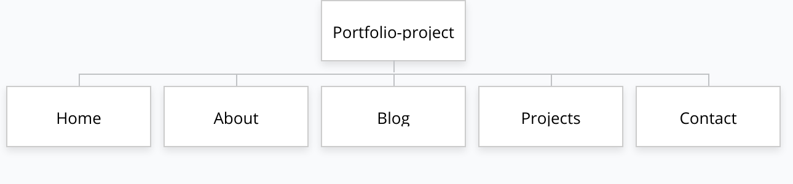
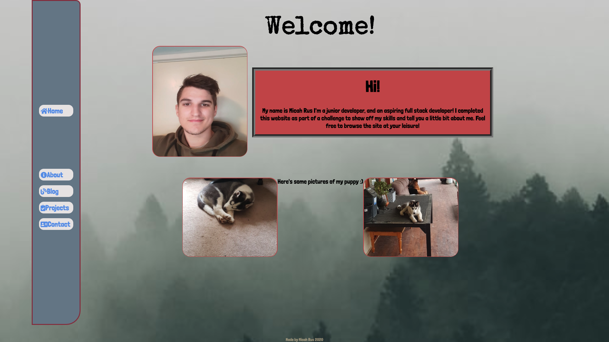
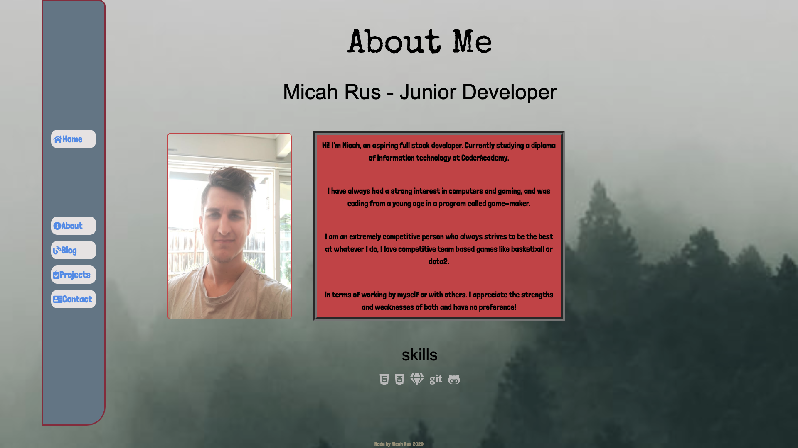
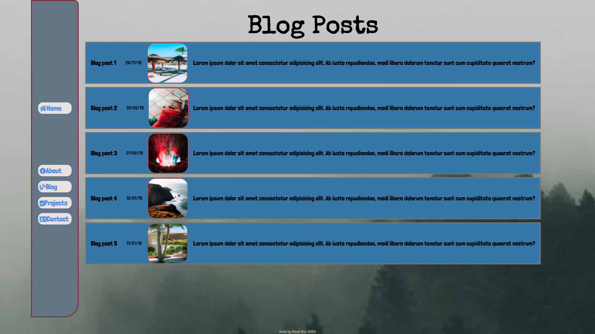
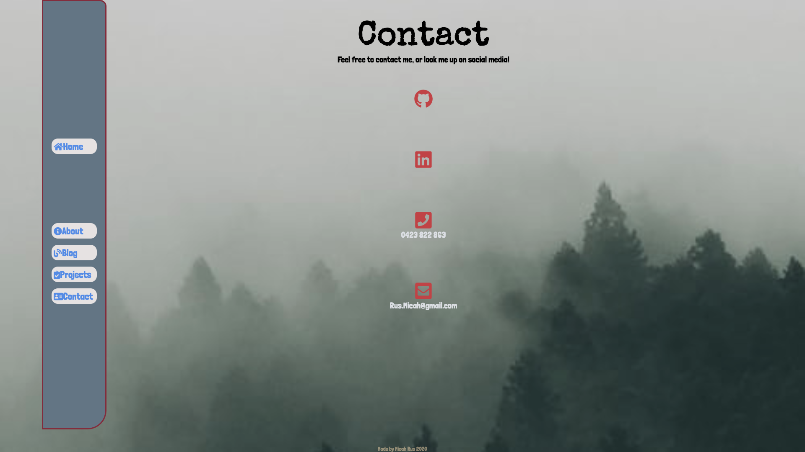
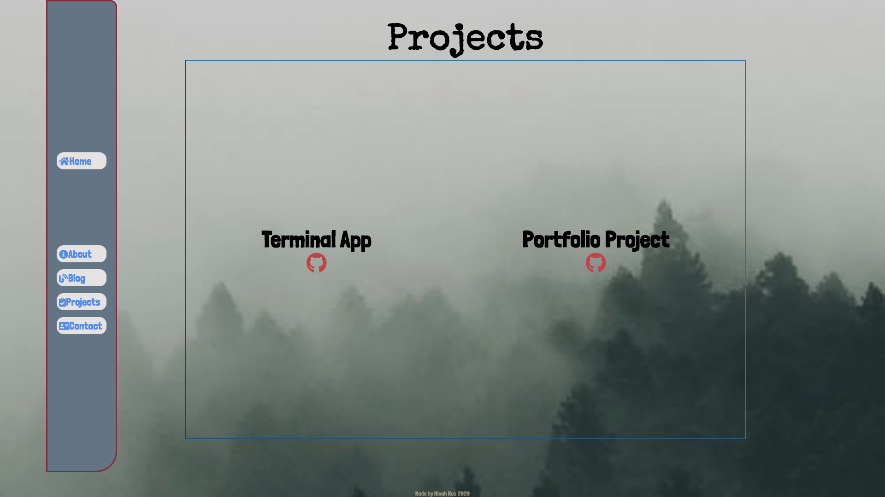

# Micah Rus - Portfolio Project

Website : <https://micah-rus-portfolio-project.netlify.com/index.html>

Github <https://github.com/Hexicans96/Portfolio-Project>

Slide deck <https://www.canva.com/design/DAD4QXHU1l4/G3gjEKvKGzGi1FeiZPTkDA/edit?category=tACFasDnyEQ>

## Purpose

The purpose of my website is to create a portfolio in which I give examples of my coding prowess as well as have links to all existing and previous projects. I can then show this website to potential employers or tech leads.

## Functionality/Features

### Navigation bar / Footer

This site will include a navigation bar which is locked to the side of the screen (Or top in mobile/tablet view) in which the user will be able to access all the related pages of my website(Home, About, Projects, Blog, Contact) this navigation bar will be accessible on each different page and will provide the user with an easy way to travel around my website. There will also be a footer set to the bottom of the page which is there to say who built the website, as well as for copyright reasons.

### Version control

Throughout this project I was using git/github with regular commits to make sure I always have a safety net with earlier versions to revert back to. I was mainly working on 3 different branches.

1. Mobile-view.
2. Master.
3. Initial-body.

At the end point of the project I actually had to revert to a previous version due to a merging error.

### Accessibility 

Throughout the project I was using semantic HTML wherever possible. as well as adding alt text to any image I uploaded to the project.

### Responsive design

Due to the fact that people might view my website on multiple devices, I wanted to make it accessible to everybody. I initially designed the website in desktop format, then I added media query's for both mobile phone view as well as tablet view.

### Security

I have created a subresource integrity hash to help combat people injecting malicious content into my website.

## Site-map 

## Screenshots 

## Target audience

- Potential employers

- Tech leads / team members

## Tech stack

- HTML5
- CSS
- SCSS
- Balsamiq 
- VScode
- Git
- Github
- Netlify 